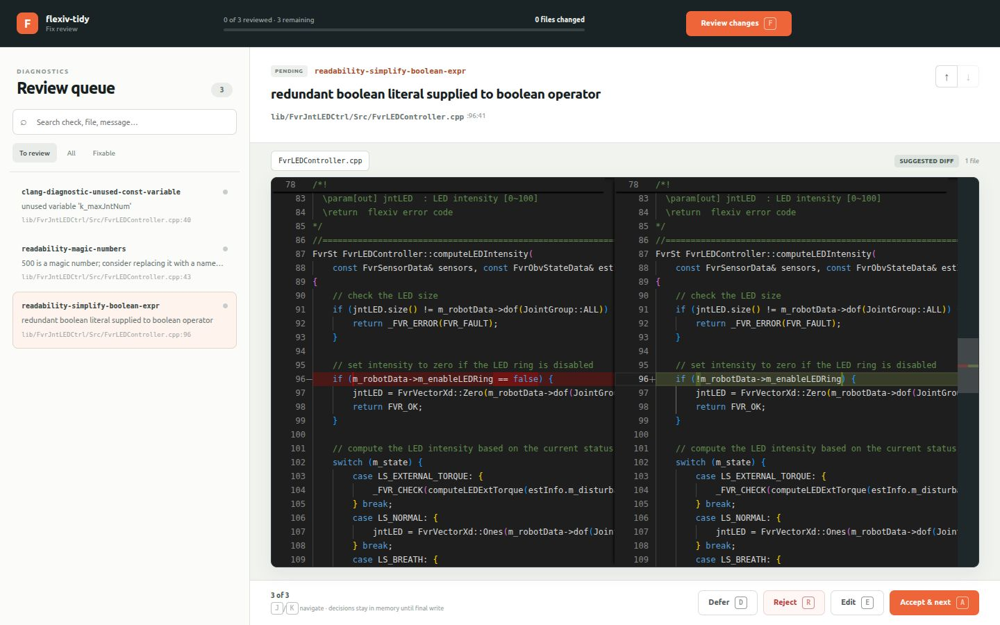
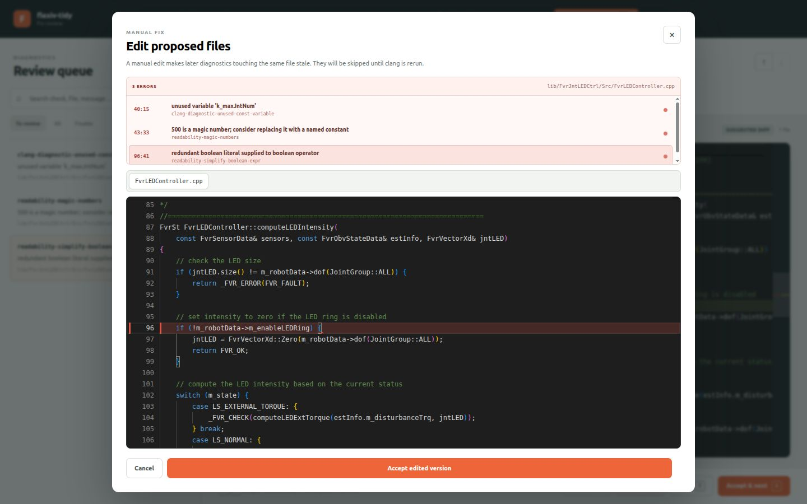

# flexiv-tidy

Standalone runner for Flexiv's clang-tidy fix workflow and the fast
`clangd-tidy` diagnostics, bundled so any Flexiv worktree can use them without
checking the scripts out on its own branch.

## Quick start for coworkers

### 1. Install

You need GitHub SSH access, [`uv`](https://docs.astral.sh/uv/), Python 3.10+,
and a Flexiv software worktree with its normal Docker build environment.

Install the latest version directly from the repository:

```sh
uv tool install "git+ssh://git@github.com/yda-flexiv/flexiv-tidy.git"
flexiv-tidy --help
```

If `flexiv-tidy` is not found after installation, run `uv tool update-shell`
once and start a new shell.

To update an existing installation:

```sh
uv tool install --force "git+ssh://git@github.com/yda-flexiv/flexiv-tidy.git"
```

For tool development, clone the repository and use an editable installation:

```sh
git clone git@github.com:yda-flexiv/flexiv-tidy.git ~/ws/utils/flexiv-tidy
uv tool install --editable ~/ws/utils/flexiv-tidy
```

### 2. Prepare a Flexiv worktree

Run commands from inside the Flexiv worktree. `flexiv-tidy` discovers its Git
root automatically. Generate the clang-tidy compilation database once if it
does not already exist:

```sh
cd ~/ws/flexiv_sw/<your-worktree>
cmake --preset ubuntu-static-check -B build/clang-tidy
```

### 3. Review and apply fixes

Pass either a unique library name, a path below `lib/`, or a full repository
path. The default command opens the local Web UI:

```sh
flexiv-tidy fix FvrRemoteParam
flexiv-tidy fix --library-only comm/FvrRemoteParam
```

Fixable diagnostics open directly in a Monaco suggested-diff view. Use `A` to
accept, `R` to reject, `D` to defer, and `E` to edit manually. Manual editing
shows every diagnostic in the active file; select a diagnostic to jump to its
line. Nothing is written to source files until **Review changes → Write
changes** is confirmed.





### 4. Run fast diagnostics

Install the pinned `clangd-tidy` runtime once per Docker build container, then
run checks on one or more paths:

```sh
flexiv-tidy install
flexiv-tidy clangd lib/base/FvrBase
flexiv-tidy clangd -j 8 lib
```

### Useful alternatives

Use `--project` when invoking the tool from outside the target worktree:

```sh
flexiv-tidy --project ~/ws/flexiv_sw/v4.x_develop fix FvrRemoteParam
```

Use the terminal reviewer when a browser is unavailable:

```sh
flexiv-tidy fix --tui FvrRemoteParam
```

For a remote development host, bind a fixed local port and open the printed
URL through your normal SSH port-forwarding setup:

```sh
flexiv-tidy fix --no-open --web-port 8765 FvrRemoteParam
```

## Web fix review

`fix` collects suggestions without changing source files, then opens a local
browser reviewer. It binds only to `127.0.0.1`, uses a per-run access token,
and queues every decision in memory until **Write changes** is confirmed.

The reviewer provides:

- a searchable, filterable diagnostics queue;
- an offline Monaco editor with syntax highlighting and line numbers;
- automatic selection of fixable diagnostics and an immediate suggested diff;
- exact error-line navigation when clang-tidy has no automatic fix;
- `A` accept, `R` reject, `D` defer, `E` edit, and `J`/`K` navigation shortcuts;
- safe manual edits that mark later findings in the edited file as stale; and
- a combined final diff before any file is written.

## Commands

### `fix <library> [options]`

Runs clang-tidy on one library's translation units, then opens the Web UI to
review exported fixes. The library may be a unique short name
(`FvrRemoteParam`), a path under `lib/` (`comm/FvrRemoteParam`), or a repository
path.

Options are forwarded to the bundled `fix_clang_tidy.sh`:

```
-n, --dry-run              report diagnostics without opening the reviewer
    --apply-all            apply all available fixes without review (risky)
    --include-dependencies include diagnostics/fixes in dependencies under lib/
    --library-only         only report/fix files inside the selected library
-j, --jobs <count>         parallel clang-tidy jobs (default: CPU count)
    --build-dir <dir>      compilation database directory (default: build/clang-tidy)
    --tui                  use the terminal reviewer instead of the Web UI
    --no-open              print the Web UI URL without opening a browser
    --web-port <port>      bind the Web UI to a specific local port
```

### `clangd [paths...] [options]`

Fast clang-tidy diagnostics through one persistent `clangd` process
(`clangd-tidy`). `paths` default to `lib/`. Options are forwarded to the
bundled `run_clangd_tidy_check.sh`:

```
-j, --jobs <count>         clangd worker count
    --batch-size <files>   files per clangd process (default: 25)
-p, --compile-commands-dir <dir>
```

### `install`

Installs the pinned `clangd` and `clangd-tidy` runtime inside the Docker build
container. Idempotent; run once per container before `clangd`.

## Requirements

- The target worktree must contain `docker/docker_dispatch.sh` and a configured
  `build/clang-tidy/compile_commands.json`.
- Python 3.10+ and PyYAML are installed with `flexiv-tidy`.
- A modern browser is recommended for fix review; `--tui` needs only a terminal.

The only machine outside the worktree that is written to is
`<worktree>/build/.flexiv-tidy/`, which stages bundled scripts for the Docker
mount. Source changes are written only after final confirmation.
